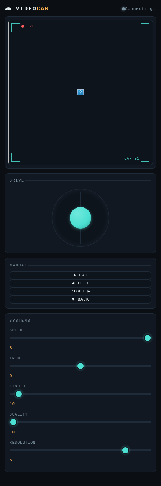

# 🚗 VideoCar

**Repo:** [github.com/abourdim/video-car](https://github.com/abourdim/video-car)

```
git clone https://github.com/abourdim/video-car.git
cd video-car
```

Enhanced firmware + web control page for the keyestudio ESP32-CAM Video Smart
Car. Built on top of keyestudio's stock sketch, with a virtual joystick,
connection-loss failsafe, snapshot/video capture, a redesigned control UI, and
a PlatformIO build system alongside the original Arduino IDE sketch.

📖 **Official hardware/assembly tutorial:** [docs.keyestudio.com/projects/KS5017](https://docs.keyestudio.com/projects/KS5017/en/latest/docs/Tutorial.html)
-- kit list, assembly steps, pinout, and the original stock code this project
builds on. Start there for hardware assembly; this repo picks up once the car
is physically built and the stock sketch runs.



## Quick start

**Arduino IDE** (known-good baseline): open `Codes/4_VideoCar/4_VideoCar.ino`,
select your `esp32` board package version under `Tools > Board > Boards
Manager`, enable `Tools > PSRAM: Enabled`, select the AI-Thinker ESP32-CAM
board, and flash as usual.

**PlatformIO**:
```
./launch.sh
```
Walks you through checking/installing PlatformIO, building, flashing, and
opening a serial monitor. See [Build systems](#build-systems) below for what
each menu option does.

Once flashed, connect to the `keyes1` WiFi network (password `88888888`) and
open `http://192.168.4.1` in a browser.

> ### ⚠️ The Vision features need internet -- the default AP mode has none
>
> Out of the box (`ap = 1`) the car hosts its own isolated `keyes1` network,
> which isn't connected to anything. **Pose, Hand tracking, Facial expression,
> Plates, AI Vision, and the jsQR fallback all download their models from a
> CDN the first time you enable them, so on the car's own AP they will fail to
> start.** Driving, the video stream, snapshots, and recording all work fine
> there -- it's only the model-backed overlays that don't.
>
> To use them, set `ap = 0` near the top of `4_VideoCar.ino` along with your
> router's `ssid`/`password`, reflash, and read the car's IP off the serial
> monitor. Your phone or laptop then has the car and the internet at the same
> time.
>
> The one exception is **QR / Barcode** on Chrome, Edge, or Android Chrome,
> which uses the browser's built-in `BarcodeDetector` and needs no network at
> all -- that one works on the car's own AP.

## Features (vs. the stock keyestudio sketch)

- **Joystick control** — draggable on-screen joystick (`/joystick?x=&y=`),
  arcade-mixed to per-wheel PWM, alongside the original D-pad/keyboard
  controls.
- **Connection-loss failsafe** — the car auto-stops if no command is received
  for 500ms (WiFi drop, phone locked, tab closed, etc.), instead of driving
  on unattended. WiFi auto-reconnect in station mode, MJPEG stream
  auto-recovery, and a live connection indicator.
- **Settings persistence** — Speed, Trim, Lights, Quality, Resolution, Flip,
  and Mirror are all remembered two ways: on the car itself (NVS flash,
  survives reboots/reflashes, same for any device that connects) and in the
  browser's `localStorage` (instant restore on reload). On page load the
  device's own values always win if they differ from the local cache.
- **Live flip/mirror toggles** — Flip and Mirror buttons in the Systems panel
  call the sensor's `set_vflip`/`set_hmirror` live, so you can fix the
  camera's orientation for your chassis without reflashing.
- **Pose detection** — MoveNet skeleton tracking (light blue), dots + limb
  lines over up to a few people at once.
- **Hand tracking** — MediaPipe Hands via TF.js's `tfjs` runtime (avoids a
  separate MediaPipe script/wasm bundle from yet another host), 21
  keypoints per hand plus left/right handedness (orange).
- **Facial expression** — happy/sad/angry/surprised/etc. via
  `@vladmandic/face-api` (an actively-maintained fork of the long-dormant
  face-api.js), whose model weights are published in the same npm package
  as the script — unlike most of Vision, this only depends on a single
  host (jsdelivr) rather than two.
- **QR / Barcode** — uses the browser's built-in `BarcodeDetector` when
  available (Chrome/Edge/Android Chrome) — no network needed at all, works
  even on the car's own isolated AP. Falls back to the jsQR library (QR
  codes only, needs internet once) on browsers without native support
  (Safari/iOS).
- **Plates** — an experimental license-plate reader. There's no ready-made
  plate-detector model like there is for objects/faces, so this reuses
  COCO-SSD's car/truck/bus boxes, crops the likely plate region, and runs
  real OCR (Tesseract.js) on it. Heuristic, not a trained detector, and
  limited by the camera's 320×240 resolution — works best close, square-on,
  and well-lit. Runs on its own slower ~2.5s cadence since OCR is much
  heavier than object/face detection.
- **AI Vision** — a toggleable live overlay detecting both objects (COCO-SSD)
  and faces (BlazeFace) right over the viewfinder, running entirely in the
  browser since the ESP32 can't run a neural net alongside everything else.
  Needs internet access on the network the device is using to load the
  models the first time.
- **Build stamp** -- the control page footer, `/status`, and the serial console
  at boot all report the firmware version, the compiler's build timestamp, and
  the git revision it came from (with a `-dirty` suffix, shown in amber, when
  the tree had uncommitted changes). Previously there was no way to tell what
  was actually running on a car short of reflashing it. The revision is stamped
  by a PlatformIO pre-build hook; Arduino IDE has no equivalent, so builds from
  there report `nogit` rather than a possibly-stale hash. The control page is
  also served `Cache-Control: no-store`, so a browser can't pair a cached page
  with newer firmware.
- **Classic CV (no models, no internet)** -- three features that work on the
  car's own AP with nothing downloaded, because they're plain pixel maths
  rather than a neural net. They also run at full frame rate instead of the
  0.4-2.5Hz a model manages on a phone, which is what makes the driving ones
  viable:
  - **Motion** -- frame differencing, boxes whatever moved. Subtracts the
    global brightness shift first, since the OV2640's constant auto-exposure
    hunting would otherwise read as full-frame motion indoors.
  - **Line** -- follows a dark line on a light floor, or a light one on a dark
    floor. The threshold adapts to whatever contrast the line actually has
    rather than assuming, and it refuses to lock on to a blank floor instead
    of chasing sensor noise. Tuned deliberately slow: the full loop (camera,
    JPEG, WiFi, browser, HTTP back, I2C) has enough delay in it that a faster
    or higher-gain loop goes unstable rather than going quicker. `LINE_SPEED`
    is the knob to raise once it tracks reliably. Leave the Speed slider high
    -- the autonomous modes cap themselves well below it, and the two
    multiply.
  - **Colour chase** -- drives at the nearest blob of a chosen colour. Matching
    is done in rg-chromaticity, so a shadow falling across the target doesn't
    lose it. "Sample centre" picks the colour off whatever the car is pointed
    at, rather than making you guess a hex value.

  Line and Colour chase drive the car, and share Follow-me's arbiter and
  safety rules: manual input always wins, only one autonomous mode runs at a
  time, and a lost target stops the car and then disarms. Motion is passive,
  so it keeps running alongside whatever else is steering.
- **Offline model cache** -- the Vision features load scripts from a CDN and
  model weights from Google's model hosting, neither of which the car's own AP
  can reach. Fetches to those hosts are now cached in IndexedDB and read back
  transparently, so turning a feature on once somewhere with internet makes it
  work from then on over the car's own WiFi. There's no download button to
  press: it caches as it goes. The Offline panel shows what's stored and can
  clear it. (Service workers and the Cache API would be the obvious tools here
  and are both unavailable -- they require a secure context, and this page is
  plain HTTP. Tesseract.js, used by Plates, loads from inside a Web Worker and
  isn't covered.)
- **Follow-me (autonomous)** -- the one feature here that actually drives the
  car. It takes COCO-SSD's bounding box for a chosen target (person, ball,
  dog, cat, bottle, chair) and runs a proportional controller on it:
  horizontal offset from frame centre becomes steering, box height becomes
  throttle, and both go out over the same `/joystick` endpoint manual driving
  uses -- so the firmware needed no new handler and the 500ms failsafe covers
  this mode too. Frames come off the live MJPEG stream rather than a second
  `/capture` poll, which is what makes a real control loop possible.
  Disarmed by default; touching an arrow key, the D-pad or the joystick takes
  over instantly. Output is capped well below full speed (reverse capped
  harder, since there's no rear sensor), and losing the target stops the car
  and then disarms rather than sending it hunting. Needs internet once to
  load the model. **Give the car clear floor space before arming it.**
- **Snapshot & video recording** — a Capture panel downloads a still JPEG, or
  records a `.webm`/`.mp4` client-side (Canvas + MediaRecorder pulling frames
  from `/capture`) since the ESP32 itself can't encode video or write to an
  SD card in this sketch.
- **Redesigned control page** — dark mission-control / camera-viewfinder HUD
  theme, grouped panels, live slider value readouts, responsive layout.
- **Camera init resilience** — retries at a lower XCLK before giving up,
  blinks a visible LED error pattern instead of silently failing, and enables
  the brownout-detector workaround that shipped commented out in the
  original sketch.

Full change-by-change writeup: [`report.html`](report.html).

## Repository layout

```
Codes/                  Original Arduino-IDE-style sketch layout (all 4 sketches)
  4_VideoCar/            The enhanced sketch -- flash this one from Arduino IDE
firmware/                PlatformIO projects, one per sketch
  1_blink/                Onboard LED blink demo
  2_breathing_light/      PWM LED fade demo
  3_motor/                Motor driver test sequence (drives on boot -- give it room!)
  4_videocar/              Mirrors Codes/4_VideoCar -- the main project
launch.sh                Interactive PlatformIO menu, lets you pick which app to build/flash/monitor
README.html               Rendered version of this file
report.html               Detailed change report -- what changed, why, and what's still open
```

`Codes/4_VideoCar` and `firmware/4_videocar/src` are kept in sync -- same
source, two build systems. If you edit one, mirror the change into the other.
The other three sketches (`1_blink`, `2_breathing_light`, `3_motor`) only
exist as Arduino sketches under `Codes/` and as PlatformIO projects under
`firmware/` -- no enhancements have been made to those, they're simple demos
included for a complete workshop package.

## Build systems

### PlatformIO (`firmware/`)

Each sketch is its own PlatformIO project under `firmware/<name>/`, all
targeting `env:esp32cam` (AI-Thinker pinout) since it's the same physical
board for all four:

| App | Notes |
|---|---|
| `1_blink` | Trivial LED blink, no special config needed. |
| `2_breathing_light` | PWM LED fade, no special config needed. |
| `3_motor` | Drives forward/back/left/right immediately on boot/reset -- **give the car room to move** before flashing or resetting it. |
| `4_videocar` | The main project -- see the table below for why its `platformio.ini` has extra settings the other three don't need. |

`firmware/4_videocar/platformio.ini`:

| Setting | Value | Why |
|---|---|---|
| `platform` | `espressif32@6.5.0` | Pinned, not left on "latest" -- an unpinned platform can silently pull a different `esp32-camera` driver version than what Arduino IDE has installed, which changes camera sensor-probe behavior. `6.5.0` (arduino-esp32 2.0.14) is the version this project is confirmed working against. The other three apps are pinned to the same version too, for consistency, even though they're too simple to be sensitive to it. |
| `board_build.partitions` | `huge_app.csv` | The camera+WiFi+webserver binary doesn't fit the default partition table. Same as picking "Huge APP (3MB No OTA/1MB SPIFFS)" in Arduino IDE. |
| `build_flags` | `-DBOARD_HAS_PSRAM`, `-mfix-esp32-psram-cache-issue` | Arduino IDE's `Tools > PSRAM: Enabled` menu sets these behind the scenes; PlatformIO's generic `esp32cam` board definition does not, even though the board has PSRAM. **This was the actual root cause of "works in Arduino IDE, camera fails in PlatformIO" (`Camera init failed with error 0x106`)** -- see [Troubleshooting](#troubleshooting). |
| `upload_speed` | `460800` | Safer default than 921600 for boards flashed through a bare FTDI adapter with no auto-reset circuit. |

`launch.sh` menu:

```
0) Select app               5) Build + Flash + Monitor
1) Check installation       6) Serial monitor
2) Install PlatformIO       7) List serial ports
3) Build firmware           8) Clean build
4) Flash firmware
```

It prompts for which app to work with on startup (auto-discovers any
`firmware/<name>/platformio.ini`), and option 0 switches apps at any time
without restarting the script. Option 4 (Flash) prints the IO0/BOOT-button
reminder most bare ESP32-CAM programmers need: hold IO0, tap RESET, release
IO0 once "Connecting...." is actively retrying -- and an extra warning for
`3_motor` about giving the car room to move.

If you change a `platformio.ini` (e.g. re-pinning the platform version), run
option 8 (Clean) before rebuilding so a stale `.pio/` cache doesn't mask the
change.

### Arduino IDE (`Codes/4_VideoCar/`)

Standard Arduino IDE flow. Make sure `Tools > PSRAM` is set to `Enabled` and
`Tools > Partition Scheme` is set to a scheme with enough app space (e.g.
"Huge APP (3MB No OTA/1MB SPIFFS)").

## Troubleshooting

See also the official tutorial's own [Common Problems](https://docs.keyestudio.com/projects/KS5017/en/latest/docs/Tutorial.html#common-problems) section (wrong board selection, IP/WiFi connection issues, battery/charging) for issues unrelated to this repo's changes.

**`Camera init failed with error 0x106` (only under PlatformIO, works fine in
Arduino IDE):** This is `ESP_ERR_NOT_SUPPORTED` from the camera sensor probe.
If the same board works in Arduino IDE, it's a toolchain/build-flag mismatch,
not hardware -- see the PSRAM/platform-pinning notes in the table above. This
project's `platformio.ini` is already configured to avoid it; if you still
hit it, run `./launch.sh` option 8 (Clean) to clear any stale build cache,
and confirm your Arduino IDE's installed `esp32` core version (`Tools > Board
> Boards Manager`) roughly matches the pinned PlatformIO platform version --
if it's wildly different, re-pin `platform = espressif32@X.Y.Z` to match.

**Repeated resets right after a camera error:** Usually a marginal power
supply -- camera + WiFi init draws a current spike many FTDI adapters can't
supply cleanly. Use a proper 5V/2A source. The sketch already enables the
brownout-detector workaround, which will surface this as a clean retry/error
message instead of a silent reboot loop, but it doesn't fix underlying
undervoltage.

**Car doesn't stop when you close the browser tab / lose WiFi:** Shouldn't
happen -- the firmware failsafe stops the motors after 500ms without a
command. If you're seeing otherwise, check the build stamp in the control page
footer -- if it says `nogit` or an unexpected commit, you may be running stock
keyestudio firmware, which has no such failsafe.

**A Vision feature says it can't load, on the car's own WiFi:** Expected the
first time. The models come from a CDN and the car's AP has no internet. Join
a router, turn the feature on once so its files land in the offline cache
(the Offline panel will show the count and size), then go back to the car's
AP -- it'll work from then on. Plates is the exception: Tesseract.js loads
from inside a Web Worker that the cache can't intercept, so it stays
internet-only.

**The video feed dies when a Vision or autonomy feature starts:** The stream
is fetched with `crossorigin="anonymous"` so the page can read frames from
it, which requires the CORS header the firmware sets on port 81. If they ever
disagree the browser refuses the image outright. The page detects this and
reconnects without CORS after two failures, falling back to `/capture`
polling, so it should self-heal within a couple of seconds -- if it doesn't,
compare the commit in the footer's build stamp against `git log --oneline`.
Reflash if they disagree.

**Line follower doesn't move at all:** Put the Speed slider at maximum. It
multiplies with the mode's own cap, and `LINE_SPEED` is deliberately low
(26), so a reduced slider can leave the motors below their stiction floor.
If it still won't move, raise `LINE_SPEED` in `app_server.h`.

**Line follower weaves or loses the line:** Lower `LINE_KP`, don't raise it.
The loop is limited by round-trip latency rather than by gain, and more gain
makes a delay-dominated loop worse. If it misses corners instead, raise
`LINE_TURN_CUT` so it slows down more while steering. If it reports "looking
for a line" over a real line, the contrast is too low -- use wider, darker
tape before touching `LINE_MIN_CONTRAST`.

**An autonomous mode won't stay armed:** Any manual input disarms it by
design, as does hiding the browser tab, and losing the target stops the car
after 0.7s and disarms after 3s. All three are intentional.

**No authentication on the control endpoints:** Known, unaddressed
limitation carried over from the original sketch -- see `report.html` for
details. Anyone on the `keyes1` WiFi network (default password `88888888`)
can drive the car.

## Git history

```
git log --oneline
```
Each commit is a self-contained feature/fix; `git log -p` gives the full
line-by-line diff against the original keyestudio sketch at any point.
